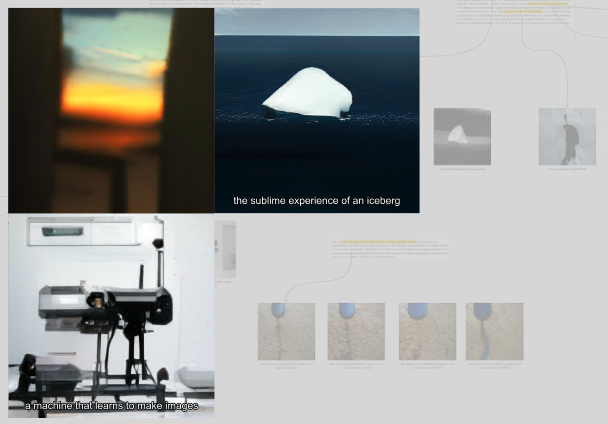

# Machine Learning for the Arts Bootcamp

Wednesday November 10, 5:30-8:00pm | [Johnny Carson Center for Emerging Media Arts](https://maps.unl.edu/CEMA)
 
Prof. Robert Twomey | rtwomey@unl.edu

Register here: [go.unl.edu/ml4abootcamp](https://go.unl.edu/ml4abootcamp)

## Description

This bootcamp is a gentle introduction to Art and Machine Learning (ML), in advance of the [EMAR349 Machine Learning for the Arts](http://ml.roberttwomey.com) course in Spring 2022. The goal is to introduce both the technical software tools and the conceptual application domain of ML and Art. Students who thrive in this bootcamp workshop will enjoy the semester-long course.

With recent advancements in machine learning techniques, researchers have demonstrated remarkable achievements in image synthesis (BigGAN, StyleGAN), text generation (GPT-3), and other areas of generative and perceptive ML. During this workshop, participants will gain hands-on experience with image synthesis using GANs, latent vectors and interpolations in latent space, and text-to-image translation. We will employ jupyter notebooks on Google Colab or HCC Open On Demand, which participants can employ for their own work after the event. We will discuss the strengths and limitations of these new techniques; consider relationships between text, image, and generative systems in art and literature; and relate these computational processes to human language, visual expression, and imagination.

No skills are necessary for the workshop, although some experience coding (EMAR161 or equivalent introductory coding experience with Javascript or Python) will be helpful.

## Schedule
|    Time    | Activity |
|------------|----|
| 5:30	| Introductions; Open up jupyter; Introduction to Neural Nets, Generative Adversarial Networks (GANs), Generative Text (Transformers). |
| 5:45  | Hands on with jupyter notebook and image generation: BigGAN; talk about latent vectors and GAN generation; talk about interpolations. Explore outputs. |
| 6:15	| Check in on results: Particpants share BigGAN results as a group; Q & A | 
| 6:30  | Hands on with text-to-image translation: CLIP + BigGAN + CMA-ES; Talk about format of textual "prompts"/inputs; Explore visual outputs. |
| 7:00	| Check in on results: Participants informally share work with group; Q&A about challenges/techniques. Participants continue working. |
| 7:15	| Hands on with interplolation videos: Interpolation and latent walks. |
| 7:30	| Full group Discussion, Future Directions | 
| 8:00  | End |

## Starting Jupyterlab with HCC
1. Visit Crane OOD
2. Log-in with your temporary ID and password.
   - You should see: "Welcome to the Crane OpenOnDemand Portal". 
3. Click on __Interactive Apps->JupyterLab__ in the top menu. Or Select _Interactive Sessions_ [https://crane-ood.unl.edu/pun/sys/dashboard/batch_connect/sys/bc_hcc_jupyterlab/crane/session_contexts/new](link) and click JupyterLab.
4. Specify:
   - __Working Directory__: `$HOME`
   - __Number of cores__: `2`
   - __Running time in hours__: `3`
   - __Requested RAM in GBs__: `16`
   - __Partition Selection__: `gpu`
   - __Reservation__: `emar349`
   - __GRES__: `gpu`
   - __Job Constraints__: `gpu_v100`
   - __Email__: `youremail@unl.edu`
 5. Click launch! You should see "Your session is currently starting..."
 6. Click "Connect to Jupyter"

## Jupyterlab Basics

- We will walk through together.
1. Open a terminal
2. Clone this repository: `git clone https://github.com/roberttwomey/unl-ml-art-bootcamp/`
3. You should see the .ipynb files show up in the jupyterlab file browser.

## Notebooks

Click on the links below to open the corresponding notebooks in google colab (will be replaced with HCC). You can only run one at a time.

1. BigGAN - [BigGAN_handson.ipynb](https://colab.research.google.com/github/roberttwomey/machine-imagination-workshop/blob/main/BigGAN_handson.ipynb)
2. Text to Image Generation with BigGAN and CLIP - [text_to_image_BiGGAN_CLIP.ipynb](https://colab.research.google.com/github/roberttwomey/machine-imagination-workshop/blob/main/text_to_image_BigGAN_CLIP.ipynb)
3. Generate latent interpolations - [generate_from_stored.ipynb](https://colab.research.google.com/github/roberttwomey/machine-imagination-workshop/blob/main/generate_from_stored.ipynb)
4. Batch process textual prompts - text_to_image_batch.ipynb (not yet implemented on colab)

## Discussion

- How do words specify/suggest/evoke images? 
- What do you see when you read? Are some texts more or less imagistic?
- How can we use this artificial machine imagination to understand our human visual imagination? 
- How might you incorporate these techniques into our creative production or scholarship? 
- What would it mean to diversify machine imagination?

## References
- Google Deep Mind BigGAN, [Large Scale GAN Training for High Fidelity Natural Image Synthesis](https://deepmind.com/research/publications/large-scale-gan-training-high-fidelity-natural-image-synthesis), 2018
  - see the BigGAN hands-on notebook above to get a sense for image generation with BigGAN, noise vectors, truncation, and latent interpolation. 
- NVIDIA StyleGAN2, [A Style-Based Generator Architecture for Generative Adversarial Networks](https://arxiv.org/abs/1812.04948), 2019
  - see for example [https://thispersondoesnotexist.com/](https://thispersondoesnotexist.com/), a photorealistic face generator with StyleGAN2
- OpenAI GPT-3: [Language Models are Few-Shot Learners](https://arxiv.org/abs/2005.14165), 2020
  - see Kenric Allado-McDowell's [Pharmako-AI](https://ignota.org/products/pharmako-ai) for an example a book written with GPT-3.
- OpenAI [CLIP: Connecting Text and Image](https://openai.com/blog/clip/), 2021
- OpenAI [DALL-E: Creating Images from Text](https://openai.com/blog/dall-e/), 2021
  - the interactive examples on this page will give you a sense of the kind of technique we will explore during the workshop.
- Good [list of CLIP-related to text-to-image notebooks on Reddit r/MachineLearning](https://www.reddit.com/r/MachineLearning/comments/ldc6oc/p_list_of_sitesprogramsprojects_that_use_openais/)

## Networks

__Neural Network__

<!-- -->
<!--  -->

<!-- -->

Neural Networks, or Artificial Neural Networks (ANNs) are networks (graphs) composed of nodes and edges, loosely modelled on the architecture of biological brain. They are generally composed of distinct layers of neurons, where outputs from one feed inputs of another. Broadly, each node resembles a neuron, accepting inputs from a number of other nodes, and defined with its own activiation function, bias, and forward connections. There are many variations on this basic architecture. Above we see a very simple fully connected, feed forward network that takes as an input 28 x 28 pixel grayscale images (784 input signals), and produces a 0-10 digit classifier on the output. Neural networks are used for many generative and predictive tasks across sound, image, text, etc.

__Generative Adversarial Networks (GANs)__

<!---->
<!-- cropped -->

A Generative Adversarial Network (GAN) is a kind of generative model. The basic idea is to set up a game between two players (game theory). The Generator creates samples that resemble the input dataset. The Discriminator evaluates samples to determine if they are real or fake (binary classifier). We can think of the generator as being like a counterfeiter, trying to make fake money, and the discriminator as being like police, trying to allow legitimate money and catch counterfeit money. To succeed in this game, the counterfeiter must learn to make money that is indistinguishable from genuine money, and the generator network must learn to create samples that are drawn from the same distribution as the training data. (adversarial) Both networks are trained simultaneously.

Ian Goodfellow introduced the architecture in __Generative Adversarial Nets__, Goodfellow et. al (2014) https://arxiv.org/pdf/1406.2661.pdf

__BigGAN__

<!-- -->

BigGAN (2018) set a standard for high resolution, high fidelity image synthesis in 2018. It contained four times as many parameters and eight times the batch size of previous models, and synthesized a state of the art 512 x 512 pixel image across [1000 different classes](https://gist.githubusercontent.com/yrevar/942d3a0ac09ec9e5eb3a/raw/238f720ff059c1f82f368259d1ca4ffa5dd8f9f5/imagenet1000_clsidx_to_labels.txt) from [Imagenet](https://www.image-net.org/). It was also prohibitively expensive to train! Thankfully Google/Google Brain has released a number of pretrained models for us to explore. Read the paper here https://arxiv.org/abs/1809.11096.

__CLIP__

<!---->

CLIP (Contrastive Language-Image Pre-Training) is a neural network trained on a variety of (image, text) pairs. It can be instructed in natural language to predict the most relevant text snippet, given an image, without directly optimizing for the task, similarly to the zero-shot capabilities of GPT-2 and 3. We found CLIP matches the performance of the original ResNet50 on ImageNet “zero-shot” without using any of the original 1.28M labeled examples, overcoming several major challenges in computer vision. 

CLIP pre-trains an image encoder and a text encoder to predict which images were paired with which texts in our dataset. We then use this behavior to turn CLIP into a zero-shot classifier. We convert all of a dataset’s classes into captions such as “a photo of a dog” and predict the class of the caption CLIP estimates best pairs with a given image. 

CLIP learns from unfiltered, highly varied, and highly noisy data ... text–image pairs that are already publicly available on the internet. See details on the [CLIP Model Card](https://github.com/openai/CLIP/blob/main/model-card.md#data)

To learn more about CLIP, try the Interacting with CLIP colab: https://colab.research.google.com/github/openai/clip/blob/master/notebooks/Interacting_with_CLIP.ipynb)

(from https://github.com/openai/CLIP)
